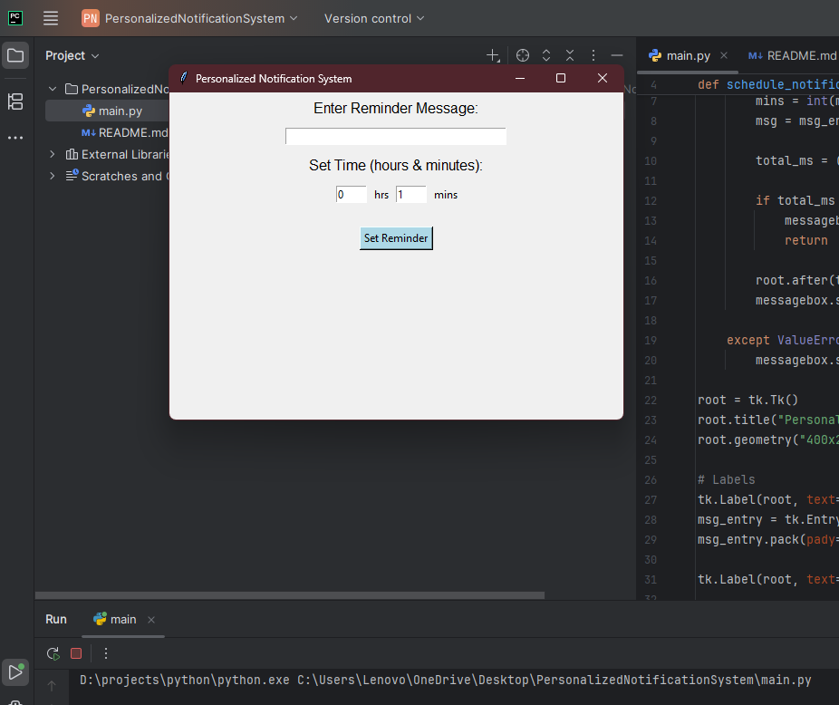
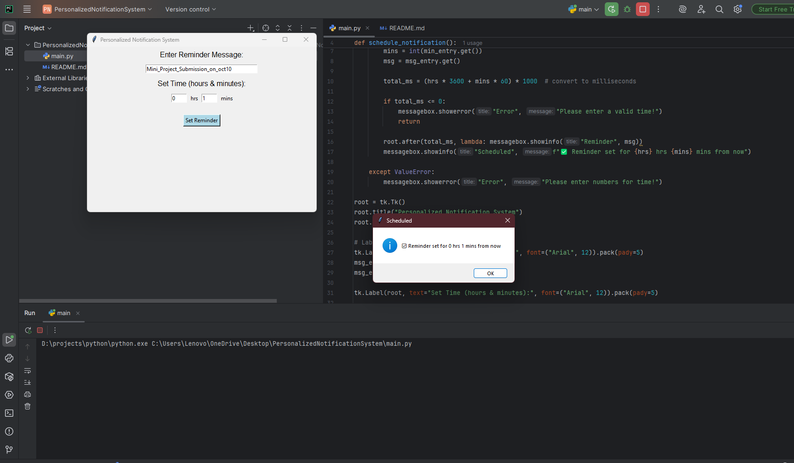
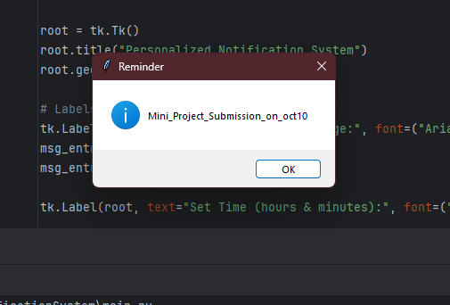

# Personalized Notification System

## Abstract
This project is a mini OS-based application that provides personalized reminders
to the user. It allows the user to enter a message and schedule a notification
after a given number of hours and minutes. After the time has elapsed, a popup
alert is displayed.

## Features
- User can enter a custom reminder message.
- User can set time in hours and minutes.
- Popup notification is shown at the scheduled time.
- Built with Python and Tkinter (no extra dependencies).

## Requirements
- Python 3.11 or Pycharm
- Tkinter (comes with Python)

## How to Run
1. Install Python 3.
2. Open terminal/command prompt in the project folder.
3. Run:  
   ```bash
   python main.py
## Screenshots

### Main Window



### Reminder Set


### Notification Popup


